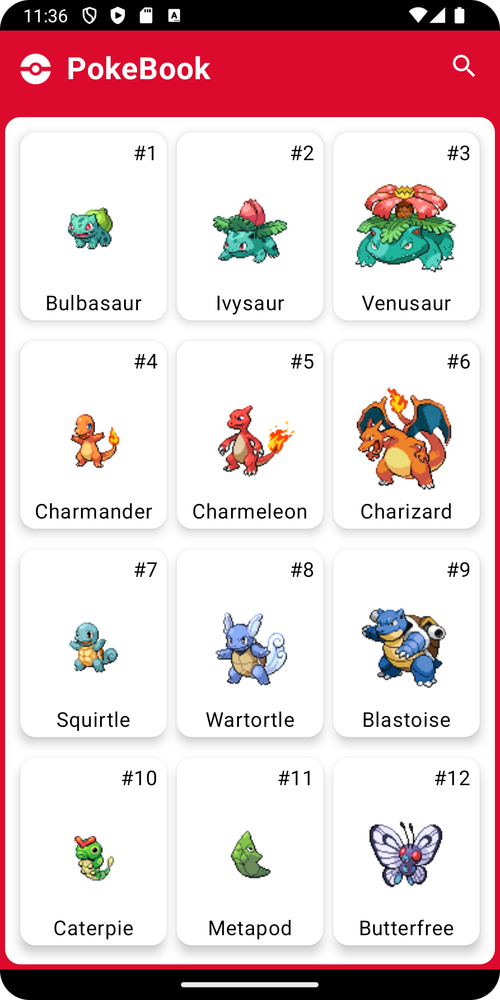
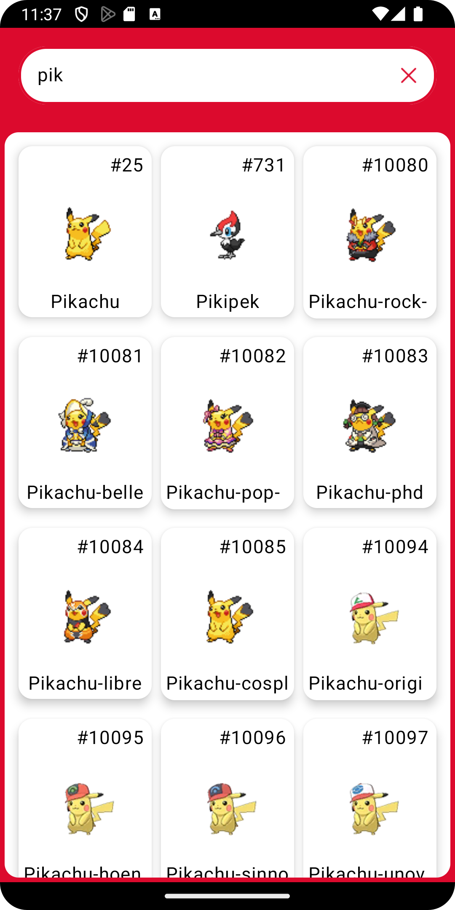
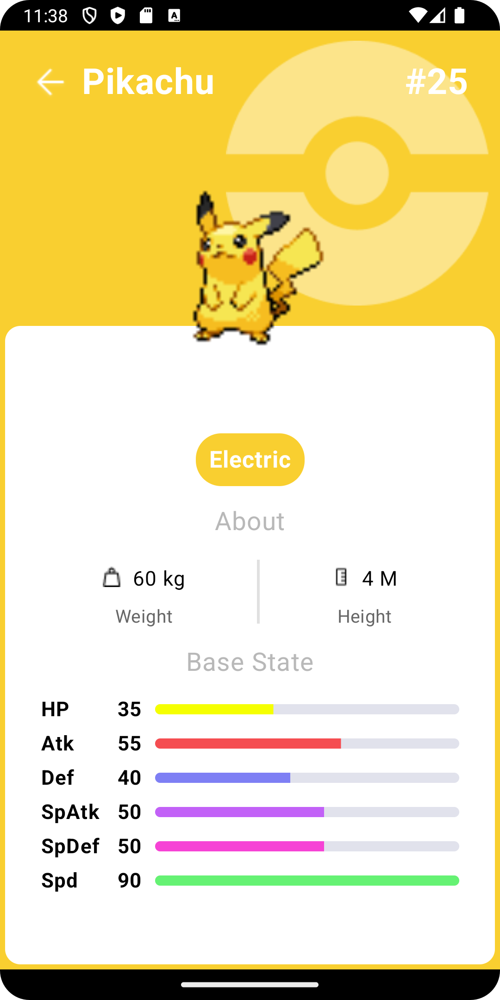

# PokeBook

#ENG
**An application I made to learn the logic of jetpack compose. We can learn information about pokemon in this application. I used the following libraries in the application.** 

#TR
**Jetpack compose mantığını öğrenmek için yaptığım bir uygulama. Bu uygulamada pokemonlar hakkında bilgi edinebiliriz. Uygulamada aşağıdaki kütüphaneleri kullandım.** 

[API URL](https://pokeapi.co/docs/v2)

**Libraries**
+ MVVM
+ Jetpack Compose
+ [Hilt](https://developer.android.com/training/dependency-injection/hilt-android)
+ [Navigation Component](https://developer.android.com/guide/navigation/get-started) 
+ [ViewModel](https://developer.android.com/topic/libraries/architecture/viewmodel#implement)
+ [Coroutines](https://developer.android.com/kotlin/coroutines)
+ [StateFlow,Flow](https://developer.android.com/kotlin/flow/stateflow-and-sharedflow#livedata)
+ [Repositories](https://developer.android.com/topic/architecture#data-layer)
  
  ***Third party libraries***
  - [Retrofit](https://square.github.io/retrofit/)
  - [OkHttp](https://square.github.io/okhttp/recipes/)
  - [Gson](https://github.com/google/gson)
  - [Glide](https://github.com/bumptech/glide)
  - [Paging3](https://developer.android.com/topic/libraries/architecture/paging/v3-overview)
  - [Timber](https://github.com/JakeWharton/timber)

## Screens
| Home Screen | Search Screen | Detailer Screen |
| --- | --- | --- |
|  |  |  |
